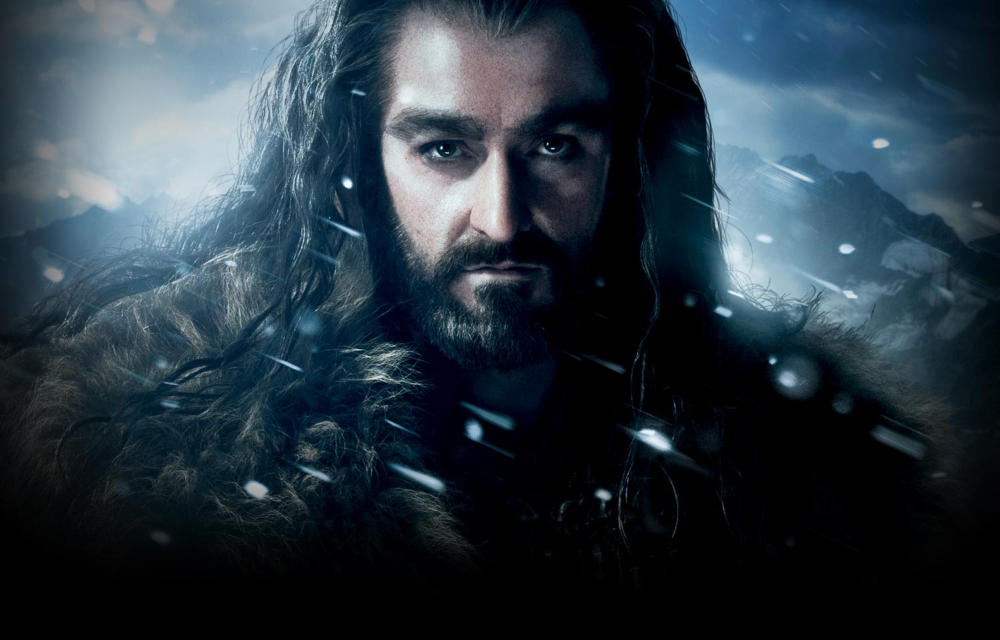

# Thorin & Dwarf Company 

[Direct link to GitHub](https://github.com/Spagettileg/thorin-and-dwarf-company)

[Direct link to live resume](https://thorin-and-dwarf-company.herokuapp.com/#)

***

This project is designed to showcase the flask framework written in python. To keep the project interesting, the cast of The Hobbit feature in a storytelling capacity where the user experiences a 'meet & greet' environment.

Furthermore, the website serves as a fan club for avid followers of The Hobbit, where the user can register to join a community of like-minded Hobbit fans.  

## Table of Contents

1. [UXD Considerations](#uxd-considerations)
    * [User & Business Objectives](#user-&-business-objectives) 
    * [Wireframes](#wireframes)
    * [User Stories](#user-stories)
    * [CSS Framework](#css-framework)
    * [Colour Palette](#colour-palette)
    * [Typography](#typography)
    * [Icon Graphics](#icon-graphics)
    * [Navbar Design](#navbar-design)

2. [Technologies Applied](#technologies-applied)
    * [Languages](#languages)
    * [Libraries](#libraries)
    * [Tools](#tools)

3. [Features](#features)

4. [Tests](#tests)
    * [Compatibility](#compatibility)
    * [Test Observations](#test-observations)

5. [Deployment](#deployment)
    * [How to run this project locally](#how-to-run-this-project-locally) 

6. [Credits](#credits)
    * [Content](#content)
    * [Media](#media)
    * [Acknowledgements](#acknowledgements)

## UXD Considerations

### User & Business Objectives

#### User
- The registered customer belongs to a community of **The Hobbit** enthusiasts
- Provide a clear insight on Thorin and his company of dwarfs
- Access to the latest links to offer user accurate information on all characters 
- Start a conversation upon latest news, old stories, etc through social media channels
- Happy to browse current reading material, without obligation to purchase
- Assured that personal details are secure from unauthorised access

#### Business
- Only registered users will enjoy benefits of joining the Thorin & Co community
- Creation of a MyHobbit account is only for registered users to ensure bonafide credentials
- Provide a simple and intuitive site for the user to click, search, read, create, add, update & delete own data. Access levels are determind through whether user has successfully registered
- Use customer feedback to further improve the offerings of Thorin and Dwarf Company
- Monitor user demand to help generate positive marketing campaigns

#### Next Stage Generation
- Create e-commerce capability to enable registered users to shop for The Hobbit merchandise
- Leverage footfall data to attract commercial online advertising, with resultaqnt revenues used to maintain and grow website
- Affiliate with film and cinema organisations through embracing user product affinity 
- Create social media channels to promote 'Thorin and Dwarf Company'

### Wireframes
My wireframe mock-up designs have been created in [Balsamiq](https://balsamiq.com/) to showcase the 'Thorin & Dwarf Company' website responsivenesson mobile, tablet and desktop devices.

•	[Thorin & Dwarf Company](https://github.com/Spagettileg/resume/blob/master/wireframes/thorinfinal.zip)

### User Stories

### CSS Framework
Bootstrap was the chosen framework for styling my project. I used the Bootstrap grid extensively to support responsiveness on mobile, tablet and desktop devices.

### Colour Palette
Colours used in this project were sourced from [MyColor Space](https://mycolor.space/). Essentially, the colours are seeking to capture a combination of fresh and earthy tones to support the key attributes of The Hobbit. Personal growth, forms of heroism and motifs of warfare.

Colour          | Hex Code
----------------|----------
Oil Blue        | #0085A1
Deep Oil Blue   | #00657B
Raincloud Grey  | #868E96
Silver Grey     | #E9ECEF
Steel Grey      | #DEE2E6
Coal Black      | #212529 
White           | #FFF

### Typography
`H1`, `H2`, `H3`, `H4`, `H5` & `H6` header classes
[Open Sans](https://fonts.google.com/), [Helvetica Neue](https://fonts.google.com/), [Helvetica](https://fonts.google.com/), [Arial](https://fonts.google.com/) & [Sans-Serif](https://fonts.google.com/) fonts were used for the header classes.

`Body` class
[Lora](https://fonts.google.com/), [Times New Roman](https://fonts.google.com/) & [Serif](https://fonts.google.com/) fonts were used throughout `body` class.

### Icon graphics
Font Awesome 5 icon graphics were used in conjunction with Bootstrap 4, primarily to support information section headers

Page           | Function                     | Font  
---------------|------------------------------|-------
TBC            | TBC                          | `tbc`

### Navbar design
For tablet and desktop views, the navbar offers 5 functions on a horizontal view. For mobile devices, all the same options collapse into a responsive design. 

- Brand Image
- Home
- About
- Contact
- Register

## Technologies Applied

### Languages
•	[HTML](https://html.spec.whatwg.org/multipage/) used as the markup language

•	[CSS3](https://www.w3.org/Style/CSS/) used to style the HTML

•	[JavaScript](https://developer.mozilla.org/en-US/docs/Web/JavaScript) used mostly for DOM manipulation. cdnjs.cloudflare.com used to animate .hover function on navigation menu elements 

### Libraries
•	[Font Awesome](https://fontawesome.com/) to provide the icon set for Re-Boot website

•	[Google Fonts](https://fonts.google.com/) provided the fonts `Mukta` & `sans-serif` used throughout the project

•	[jQuery](https://jquery.com/) is used to manipulate the DOM, for example buttons, and showing / hiding elements

•	[Bootstrap](https://www.bootstrapcdn.com/) to enable ease of website responsiveness and simplify coding structure

### Tools
•	[AWS Cloud9](https://aws.amazon.com/cloud9/) a cloud-based integrated development environment (IDE) that lets you write, run, and debug your code with just a browser.

•	[Balsamiq](https://balsamiq.com/) is a small graphical tool to sketch out user interfaces, for websites and web / desktop / mobile applications and used to visualise my project through mock-up design.

•	[Git](https://git-scm.com/) is a free and open source distributed version control system designed to handle everything from small to very large projects with speed and efficiency.

•	[GitHub](https://github.com/) is a code hosting platform for version control and collaboration. It lets you and others work together on projects from anywhere.

•	[Jigsaw - CSS validation](https://jigsaw.w3.org/css-validator/) this validator checks the markup validity of CSS style sheet and ensure coding convention is upheld

•	[JS Hint](https://jshint.com/) a tool that helps to detect errors and potential problems in the javascript code

•	[W3C - HTML validation](https://validator.w3.org/) this validator checks the markup validity of HTML web documents

## Features

**Home (index.html)**

**About (about.html)**

**Contact (contact.html)**

**Register (register.html)**

## Tests
Test analysis and reporting can be viewed in a separate [TESTS.md](https://github.com/Spagettileg/thorin-and-dwarf-company/blob/master/TESTS.md) file.

## Deployment

### Deployment to Heroku
The site has been formally deployed to [Heroku](https://thorin-and-dwarf-company.herokuapp.com/) and the latest version of my application can be found here. The following steps were taken in order to deploy:

#### AWS Cloud 9 IDE
- Flask debugging turned off by setting debug=False
- Requirements.txt file created with the command `sudo pip3 freeze --local > requirements.txt`. This is essential
- Procfile created withthe command `echo web: python run.py > Procfile`
- Push all my latest production ready code to GitHub ready for deployment via Heroku's GitHub function where you can deploy from GitHub the production ready app

#### Heroku
- From the Heroku dashboard I created a new app, using the name thorin-and-dwarf-company and set the region to Europe
- In the settings tab I clicked reveal config vars and entered the required environment variables, which in this case were:
    - Key = `IP`: Value = `0.0.0.0`
    - Key = `PORT`: Value = `5000`
    - On the deploy tab, in the Deployment method section I chose deploy from AWS Cloud 9 IDE via command `git push heroku master`

#### Local Deployment
##### Via GitHub
- Manually download the application locally to your machine and then upload to your preferred IDE
- Install the projects requirements.txt using `pip3 install -r requirements.txt`
- A few environment variables need to be updated before you can run the app:
    - `import os` - We're using os module to get the 'enviroment' variable > helps connect to AWS Cloud 9 IDE
    - `import json` - Pre-requisite for importing json data into flask application
    - `from flask import Flask, render_template, request, flash` - Importing our Flask Class. Render_Template supports writing of HTML code in python file.
    - `app = Flask(__name__)`  - Flask convention (__name__) is our variable is called 'app'. Creating an instance & storing in a variable called 'app' 
    
- Once the above steps are complete you can try run the application using `python3 run.py`

##### Via the CLI
- Clone my repo via Git using the following command `https://github.com/Spagettileg/thorin-and-dwarf-company.git`
- Install the projects requirements.txt using `pip3 install -r requirements.txt`
- A few environment variables need to be updated before you can run the app:
    - `import os` - We're using os module to get the 'enviroment' variable > helps connect to AWS Cloud 9 IDE
    - `import json` - Pre-requisite for importing json data into flask application
    - `from flask import Flask, render_template, request, flash` - Importing our Flask Class. Render_Template supports writing of HTML code in python file.
    - `app = Flask(__name__)`  - Flask convention (__name__) is our variable is called 'app'. Creating an instance & storing in a variable called 'app' 
- Once the above steps are complete you can try run the application using `python3 run.py` 

## Credits

### Content

- [Gandalf](https://www.goodreads.com/quotes/tag/gandalf#:~:text=%E2%80%9CI%20will%20not%20say%3A%20do,all%20tears%20are%20an%20evil.%E2%80%9D&text=%E2%80%9CMany%20that%20live%20deserve%20death.) quote sourced from **Good Reads**
- [Gandalf](https://en.wikipedia.org/wiki/Gandalf) character information sourced from wikipedia 
- [Balin](https://www.thecharacterquotes.com/balin) quote sourced from **The Character Quotes**
- [Balin](https://en.wikipedia.org/wiki/Balin_(Middle-earth)) character information sourced from wikipedia 
- [Thorin Oakenshield](https://bookroo.com/quotes/thorin-oakenshield) quote sourced from **bookroo**
- [Thorin Oakenshield](https://en.wikipedia.org/wiki/Thorin_Oakenshield) character information sourced from wikipedia 
- [Bilbo Baggins](http://lotrproject.com/quotes/character/bilbo) quote sourced from **LOTR Project**
- [Bilbo Baggins](https://en.wikipedia.org/wiki/Bilbo_Baggins) character information sourced from wikipedia 

### Media

- [Thorin](https://wallpaper-house.com/group/thorin-oakenshield-wallpaper/index.php) README.md image sourced from [wallpaper-house](https://wallpaper-house.com/)
- [Introduction banner image](https://live.staticflickr.com/8212/8288282995_7fe3c86f3e_b.jpg) sourced from [live.staticflickr](https://live.staticflickr.com/)

### Acknowledgements

***This website to be used for educational purposes.***

